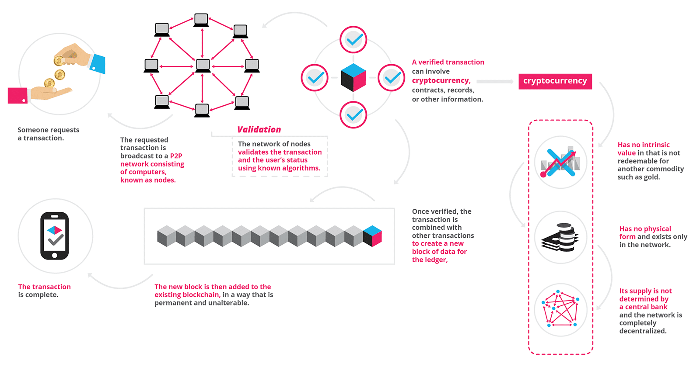

# Blockchain

A blockchain, originally block chain, is a growing list of records, called blocks, which are linked using cryptography. Each block contains a cryptographic hash of the previous block, a timestamp, and transaction data (generally represented as a merkle tree root hash). By design, a blockchain is resistant to modification of the data.

It is "an open, distributed ledger that can record transactions between two parties efficiently and in a verifiable and permanent way". For use as a distributed ledger , a blockchain is typically managed by a peer to peer network collectively adhering to a protocol for inter-node communication and validating new blocks. Once recorded, the data in any given block cannot be altered retroactively without alteration of all subsequent blocks, which requires consensus of the network majority. Although blockchain records are not unalterable, blockchains may be considered secure by design and exemplify a distributed computing system with high byzantine fault tolerance.

  Decentralized consensus has therefore been claimed with a blockchain Blockchain was invented by Satoshi Nakamoto  in 2008 to serve as the public transaction ledger of the cryptocurrency bitcoin. The invention of the blockchain for bitcoin made it the first digital currency to solve the double-spending problem without the need of a trusted authority or central server. The bitcoin design has inspired other applications, and blockchains which are readable by the public are widely used by cryptocurrencies.

image-source:https://blockgeeks.com/guides/what-is-blockchain-technology/