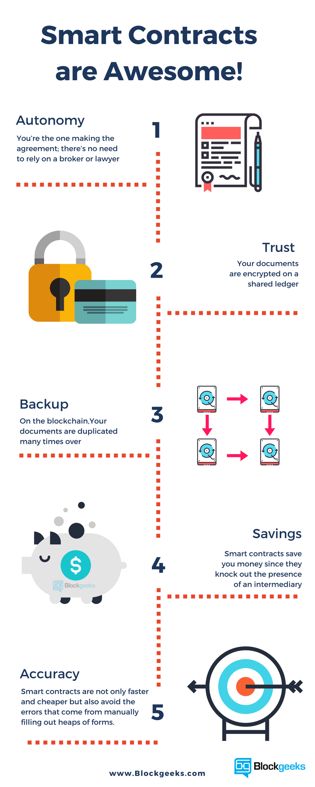

# Applications of Smart Contract

A number of new projects have come up in the recent days that either uses the existing blockchain architecture or totally new blockchain as infrastructure to create efficient contract management lifecycles. Smart contracts can be applied for dissimilar purposes in different ways with varying goals.

<ul>
    <li>Insurance</li>
    <li>Financial</li>
    <li>InstitutionsTechnology, media and telecom</li>
    <li>Energy and resource</li>
    <li>Public sector</li>
    <li>Real Estate</li>
    <li>Construction</li>
    <li>Entertainment</li>
    <li>Law</li>
    <li>Healthcare</li>
</ul>

image source:https://blockgeeks.com/guides/smart-contracts/
